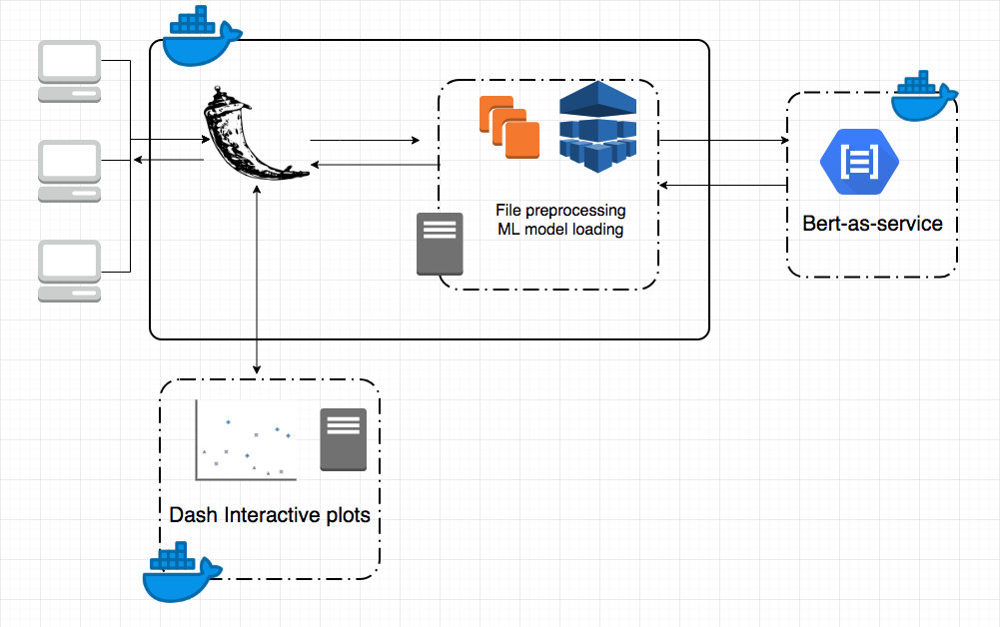

The purpose of this project is to use machine learning to faciliate data integration from different sources and access default risk of loans. The project is consisted of three independnt services, the BERT service, the Dash App and the main Flask API.

The BERT service in this project is using Google BERT NLP model to do sentence matching. For each of target column name, it will come up with a list of matching column names ranked by the matching score.

The Dash App has interactive visualization of Lending Club loan analysis.

The Flask App is the main service that loads the pre-trained machine learning model for default risk analysis and interacts with BERT service for column matching.

###Following is the infrastructure setting:

